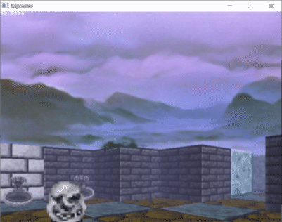
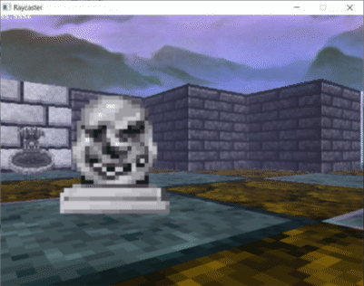
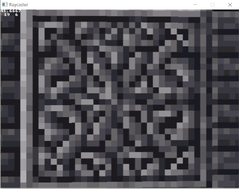

# Extending Lode's Raycaster

The code comes from Lode Vandevenne's tutorial [Raycasting III: Sprites][raycast3].

The purpose of systematically apply some enhancements and document them along the way.

The rest of the original tutorials are here [Lode's Computer Graphics Tutorial][cgtutor]

[cgtutor]: https://lodev.org/cgtutor/
[raycast3]: https://lodev.org/cgtutor/raycasting3.html

## Step 1

[commit 71797ccd2dc8cd6d633d8ef4bb3a4e2ccc1cc242](https://github.com/wernsey/lodev-enhance/commit/71797ccd2dc8cd6d633d8ef4bb3a4e2ccc1cc242)

The first step just fixes some compiler warnings.

I also didn't feel comfortable distributing this project with the
Wolfenstein 3D textures (since they ), so I replaced them with some
CC0-licensed graphics from Dungeon Crawl Stone Soup (DCSS)

The Dungeon Crawl Stone Soup graphics are from here:
<https://opengameart.org/content/dungeon-crawl-32x32-tiles>

# Step 2: Better vertical strips

The second step doesn't lead to a difference graphically, but internally
it draws all the vertical wall strips and the sprites using only
integer arithmetic.

## Step 2a

[commit e0f5cbbc6e2bb3011b210c3a2a2a779c6896769a](https://github.com/wernsey/lodev-enhance/commit/e0f5cbbc6e2bb3011b210c3a2a2a779c6896769a)

Convert the code that draws the vertical strips to use integer only arithmetic.

The integer arithmetic trick is based on the DDA algorithm from
[this article](https://web.cse.ohio-state.edu/~shen.94/681/Site/DDA.html)

## Step 2b

[commit 8039f41cc5cb93458bb6b80109ac77edf3ab47be](https://github.com/wernsey/lodev-enhance/commit/8039f41cc5cb93458bb6b80109ac77edf3ab47be)

Then you can use the same trick to draw the vertical strips of the sprites.

## Step 2c

[commit 34993e41b08c4ec51b0b936ae5d99afa2d5f9ac5](https://github.com/wernsey/lodev-enhance/commit/34993e41b08c4ec51b0b936ae5d99afa2d5f9ac5)

While you're at it, you can do the same for the horizontal part of the sprite loop.

# Step 3: Skybox

[commit c1d6246654886222c54d7fccdcbda7f228669b99](https://github.com/wernsey/lodev-enhance/commit/c1d6246654886222c54d7fccdcbda7f228669b99)

Here I disable the ceiling and draw a skybox.

# Step 4: Fog effects

[commit bb0c927871fbf0d17798a698c4c453b262d15436](https://github.com/wernsey/lodev-enhance/commit/bb0c927871fbf0d17798a698c4c453b262d15436)

We fade each pixel to a fog colour, based on its distance from the viewer

# Step 5: Doors

[commit f5980c0319457d9fc188d3ac40d5f0643f586973](https://github.com/wernsey/lodev-enhance/commit/f5980c0319457d9fc188d3ac40d5f0643f586973)

Here we implement doors that can open an close when the player interacts
with them.

To draw doors, if a ray strikes a tile with a door, we take half a
step backwards, and check whether we're still in the tile with the
door. If we are, we use the distance of the half step, otherwise
we resume casting the ray to draw what is beside or behind the door.

# Step 6: Look up and down

[commit 0ef7d398abb09a70e6952e61d83cc6d2b70f29b7](https://github.com/wernsey/lodev-enhance/commit/0ef7d398abb09a70e6952e61d83cc6d2b70f29b7)

We implement looking up and down (with the Q and A keys) by shifting
the view plane up and down.

# Step 7: Jump and crouch

[commit 61224aa5a8c08def242fb696b6947d0d12ffd35b](https://github.com/wernsey/lodev-enhance/commit/61224aa5a8c08def242fb696b6947d0d12ffd35b)

We now implement jumping and crouching by shifting the `drawStart` and
`drawEnd` variables up and down according to the viewer's height.

# Step 8: Walls with Transparency

[commit 1940b5c13ca01b096249729e97733f27571d1c9f](https://github.com/wernsey/lodev-enhance/commit/1940b5c13ca01b096249729e97733f27571d1c9f)

We implement _thin_ walls that can have transparent pixels that you can
see through.

A 1D Z-buffer doesn't suffice anymore, so we replace it with a 2D depth
buffer.

# Step 9: Glass windows

[commit 4ccf019721f557c539c28d33fb2d0b6bc9a5b84a](https://github.com/wernsey/lodev-enhance/commit/4ccf019721f557c539c28d33fb2d0b6bc9a5b84a)

We implement glass windows. They're similar to the walls from the previous
step, but we blend the pixels on them with the pixels that are behind them.

## Step 9 Part II: Fixing sprites behind glass

Unfortunately, the way we've been drawing sprites up until now means that
they are not visible when they're behind glass windows.

The problem is that we draw sprites after we've drawn the glass, by which
point the Z-buffer tells us that there is something in front of the sprite
and the sprite shouldn't be drawn.

To get around this, we make a couple of changes:

* Step 1: We move the sprite drawing code out into a separate function.
  * [commit 5cc016345417c2c010ab97f3472e0a51b887d7a0](https://github.com/wernsey/lodev-enhance/commit/5cc016345417c2c010ab97f3472e0a51b887d7a0)
* Step 2: We split the sprite drawing function into two separate functions:
  `prepareSprites()` to prepare the sprites (to determine where they are to
  be drawn) and `drawSprites()` to draw the actual sprites themselves.
  * [commit bf9b5b5edb6924808ea14436ddc1b55f7cf0073a](https://github.com/wernsey/lodev-enhance/commit/bf9b5b5edb6924808ea14436ddc1b55f7cf0073a)
* Step 3: We call the `prepareSprites()` before we start drawing the walls,
  and then as the wall strips are being drawn back to front, we check whether there's a sprite between the last wall strip we drew and the
  one we're about to draw.
  * [commit 43e990e6e71cbc5ffefc0194d221905d994548cc](https://github.com/wernsey/lodev-enhance/commit/43e990e6e71cbc5ffefc0194d221905d994548cc)

# Step 10: Push Walls

* [commit 37efb2e788aaa661c7b58bc6ee11b90b51e2f594](https://github.com/wernsey/lodev-enhance/commit/37efb2e788aaa661c7b58bc6ee11b90b51e2f594)

In this part we implement push walls that move backward when the user
interacts with them. These can be used to implement secret passages
in your levels.

# Step 11: Diagonal Walls

* [commit 7becaa49db95f28f788be632e1de03e8c60acdb2](https://github.com/wernsey/lodev-enhance/commit/7becaa49db95f28f788be632e1de03e8c60acdb2)

In this step, we implement walls that run diagonally across the grid.

